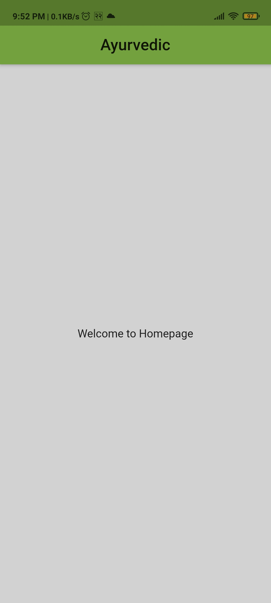

# oneTime_introScreen

A new Flutter project.

## Getting Started

This flutter app has 3 screens , when user opens app for the first time then it navigates from splash screen to 
Intro screen then home screen and next time when user opens the app it navigates from splash screen to 
Home screen.

## Here are some of the demo screenshot for you
## screenshot 1
  
## screenshot 2
 
## screenshot 3
      
